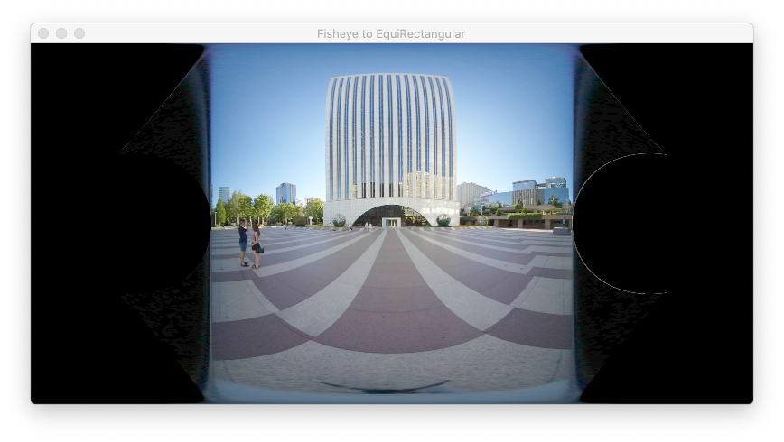
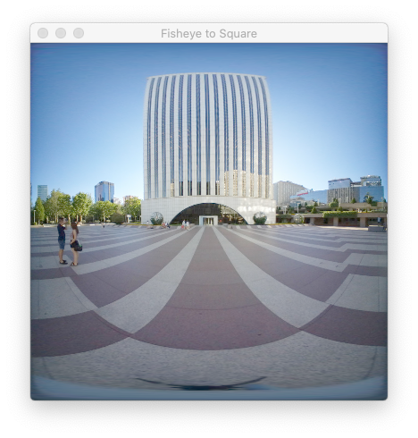
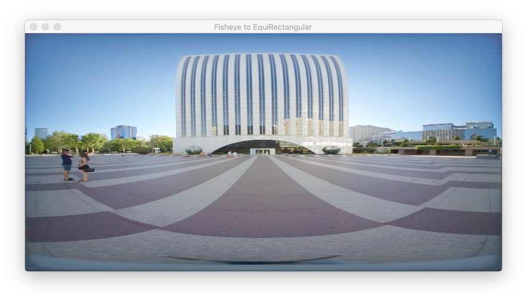
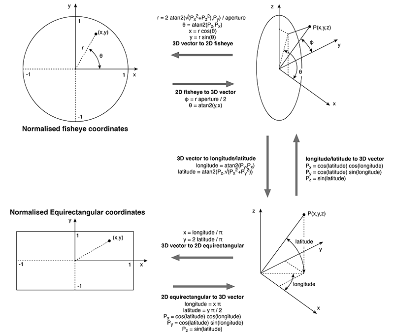

#  <#FishEye#>


This project converts single fisheye images to an 2:1 equirectangular image or 1:1 square image.
<br />
<br />
<br />


The idea of conversion is simple but implementation in glsl can lead to unexpected output.

In general, when one needs to convert a 2D input image from one format into another, a 3D vector must be generated using the texture coordinates of the 2D output image which in OpenGL the range is [0.0, 1.0] for both the u-axis and v-axis. The 3D vector is then used to generate a pair of texture coordinates which is then used to access the input image.


Refer to the source code of the fragment shader "FishEyeFragmentShader1.glsl".

The texture coordinates of the current fragment being processed is converted to a pair of Cartesian coordinates by multiplying its value with the pixel width of the input (fisheye) image. The resulting value is passed to the function "fish2sphere"  which is a GLSL port of Paul Bourke's "fish2sphere" function.

The first step taken by the function is to map the pair of pixel coordinates to a rectangle with a range of [-π, +π] for its wdith and  [-π/2, +π/2] for its vertical axis. Then, convert the longitudinal and latitudinal values to a 3D point on a unit sphere.

The spherical coordinates are used to calculate the following fisheye angles:

```glsl

    float theta = atan(psph.y, psph.x);
    float phi = atan(sqrt(psph.x*psph.x + psph.y*psph.y),
                     psph.z);

```


Notice that we don't have multiply the value of phi by 2.

The values of the 2 angles are then used to calculate the radius.

```glsl

    float r = width * phi / radians(FOV);

```


Finally, express the value of the point passed in as a parameter to the function into pixel coordinate system of the fisheye image.

 ```glsl

    pfish.x = 0.5 * width + r * cos(theta);
    pfish.y = 0.5 * width + r * sin(theta);

```

The expected output of the equirectangular images is:




Notes: to get a 1:1 output, use "FishEyeFragmentShader2.glsl". 



The range of the longitudinal values is the same as its latitudinal values. You have to edit UI widgets so that the ratios of the window and view size are 1:1 using XCode's Interface Builder module since the display rectangles of this project had been set to the ratio 2:1. Otherwise the output looks like this:





To save an image from the generated equirectangular texture, scaling is required because OpenGL's texture coordinate system is always in the ratio 1:1.


The code for the fragment shader "FishEyeFragmentShader.glsl" was derived from the diagram on Paul Bourke's site:




The value of r must be calculated as:

```glsl

    float phi = atan(sqrt(p.x*p.x + p.y*p.y),
                     p.z);

    float width = 2.0;

    float r = width * phi/radians(FOV);


```


because the following equations in the diagram:


```glsl

     x = r * cos(theta);
     y = r * sin(theta);


```

does not work. You wouldn't get any output.

Those 2 equations can be expressed in glsl as:

```glsl

     uv = vec2(r * cos(theta), r * sin(theta));

```

<br />
<br />
<br />

Web links:

 
